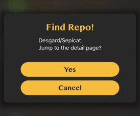

### Sepicat 简介

#### 0. 关于 Sepicat

*Sepicat* 致力于打造最 Geekful 的 Github 客户端。自创 *Card* 重阴影设计，全部动画均由 *pop* 实现，配色方案全部取自 *Vim*（暂时仅有默认主题，取色均为 **GruvBox-dark**）。

以下是关于 *Sepicat* 的一些使用技(mo)巧(fa)，请笑纳。

#### 1. 如何进行 Github 检索

**在首页中长按中间的章鱼猫按钮即可开启搜索功能**

**Github 中花式检索姿势**，如下图就是对 Stars 大于 200 且使用语言为 *Swift* 的 Repo 进行检索。（其中有炫酷的语法高亮）：

* 更多 Github 搜索 Repo 的语法技巧请打开[这个链接](https://help.github.com/articles/searching-repositories/)进行查看
* 更多 Github 搜索 User 的语法技巧请打开[这个链接](https://help.github.com/articles/searching-users/)进行查看

#### 2. 使用 URL 链接快速在 Sepicat 中查看 Repo

**在 Sepicat 外部复制一个 Github Repo 的 URL 链接，再次跳转回 Sepicat 中可以看见一下弹框，进行 Deep Link**：

#### 3. 给 Sepicat 提建(xu)议(qiu)

如果你对于 Sepicat 有更多好的提议，欢迎在工具页中的 Issue 入口中为 Sepicat 献出更好的创意。Sepicat 希望打造移动浏览 Github 时最好的体验，其一切的宗旨在于探索与发现更多好玩的 Repo，并让你及时的掌握其最新的动态。

#### 4. 感谢以下技术大牛为 Sepicat 开发提供了支持

* [Seahub](https://github.com/seahub) - 腾讯 iOS 工程师，为 Sepicat 贡献了部分源码；
* [jkpang](https://github.com/jkpang) - [PPhub](https://itunes.apple.com/cn/app/pphub-for-github/id1314212521?mt=8) 作者，为 Sepicat 贡献了很多实现思路；
* [cyanzhong](https://github.com/cyanzhong/xTeko) - [JSBox](https://itunes.apple.com/cn/app/jsbox-%E4%BC%98%E9%9B%85%E7%9A%84-javascript-%E7%BC%96%E7%A8%8B%E7%8E%AF%E5%A2%83/id1312014438?mt=8)、[Pin](https://itunes.apple.com/cn/app/pin-%E5%89%AA%E8%B4%B4%E6%9D%BF%E6%89%A9%E5%B1%95/id1039643846?mt=8) 等应用的作者钟颖大神，为 Sepicat 提供了很多实现思路。
